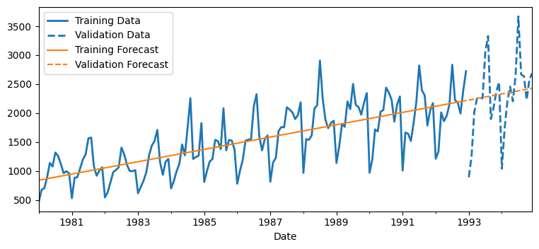
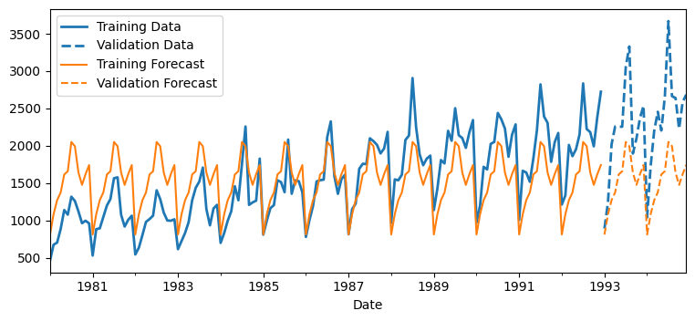
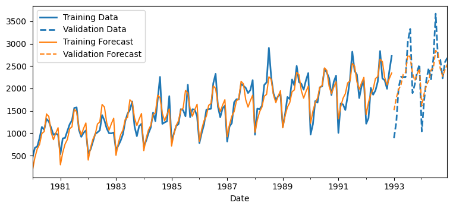

# 6211_Forecasting_lesson
This is the codebase used during the lecture on times series forecasting in the DSBA 6211 Class

*Statistically Significant Coefficients*-------------------------------------------------------------------------------------------------------------------

In a pure linear model, the Trend P-value is 0 or very close to 0 so it is significant compared to the reference since P<0.05

In a seasonality model, the Seasonal P-value for February is greater than 0.05 so it is not significant compared to the reference month January, however the rest of the months have a P-Value less than 0.05 giving them statistical significance in this model.

In a polynomial trend + seasonality model, the np.square(trend) has a P-Value of 0.739 which tells us it is not significant compared to the reference January. np.square(trend) is the trend variable squared which means it represents quadratic time trend / curvature or acceleration of the model. 

*Trend-only model comparison to Seasonality-only model*-------------------------------------------------------------------------------------------------------------------

The Trend only model has a validation RMSE that is about 231.23 lower, which means it predicts better on the validation set. Trend only model outperforms seasonlity model only on validation RMSE. So based on RMSE, the trend explains the data better than seasonlity alone.

Polynomial Trend Only Model Regression statistics

                      Mean Error (ME) : -14.7725
       Root Mean Squared Error (RMSE) : 607.4336
            Mean Absolute Error (MAE) : 430.8799
          Mean Percentage Error (MPE) : -11.5232
Mean Absolute Percentage Error (MAPE) : 25.1757

Seasonality only Model Regression statistics

                      Mean Error (ME) : 762.2853
       Root Mean Squared Error (RMSE) : 838.6621
            Mean Absolute Error (MAE) : 762.2853
          Mean Percentage Error (MPE) : 31.4759
Mean Absolute Percentage Error (MAPE) : 31.4759

Why might adding both trend AND seasonality improve accuracy?

What can you learn from the monthly coefficients?